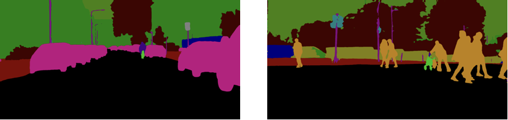

# DeepLabV3Plus for Beginners
Encoder-Decoder with Atrous Separable Convolution for Semantic Image Segmentation

## Support & Requirements
- 🔥pytorch >= 0.4.0
- 🐍python 3.6.5 
- 📈tensorboardX

- multi GPU support!


## Train
git clone & change DIR
```bash
$ git clone https://github.com/J911/DeepLabV3Plus-for-Beginners
$ cd DeepLabV3Plus-for-Beginners
```
run 🙌🙌
```bash
$ python train.py --data /data/CITYSCAPES --batch-size 16 --epoch 200 --logdir ./logs/exp1/ --save ./saved_model/exp1/
```

## Evaluate
```bash
$ python evaluate.py --data /data/CITYSCAPES --weight ./saved_model/exp1/epoch200.pth --num-classes 19
```

## Dataset

This Repository uses Cityscapes Dataset.

```
CITYSCAPES
|-- leftImg8bit
|   |-- test 
|   |-- train
|   `-- val
`-- gtFine
    |-- test 
    |-- train
    `-- val
```

## Result

- Encoder: ResNet101-OS16
- LR: 1e-2 ~ 1e-4 (CosineAnnealingLR)
- Weight Decay: 5e-4
- Epoch: 200
- Batch Size: 16 (8 images per GPU)
- GPU: 2GPU (Tesla V100 * 2)

- mIoU: 0.7521



| Class | IoU | Class | IoU | Class | IoU | Class | IoU |
|:-----:|:---:|:-----:|:---:|:-----:|:---:|:-----:|:---:|
| **road** | 0.9823 | **pole** | 0.6408 | **sky** | 0.9455 | **bus** | 0.8117 |
| **sidewalk** | 0.8528 | **traffic light** | 0.6935 | **person** | 0.8175 | **train** | 0.5439 |
| **building** | 0.9215 | **traffic sign** | 0.7805 | **rider** | 0.6328 | **motorcycle** | 0.6905 |
| **wall** | 0.4955 | **vegetation** | 0.9245 | **car** | 0.9445 | **bicycle** | 0.7738 |
| **fence** | 0.5871 | **terrain** | 0.6148 | **truck** | 0.6354 | - | - |


## Thanks to
@speedinghzl - Gain a lot of Insight 🙇🏻‍♂️
